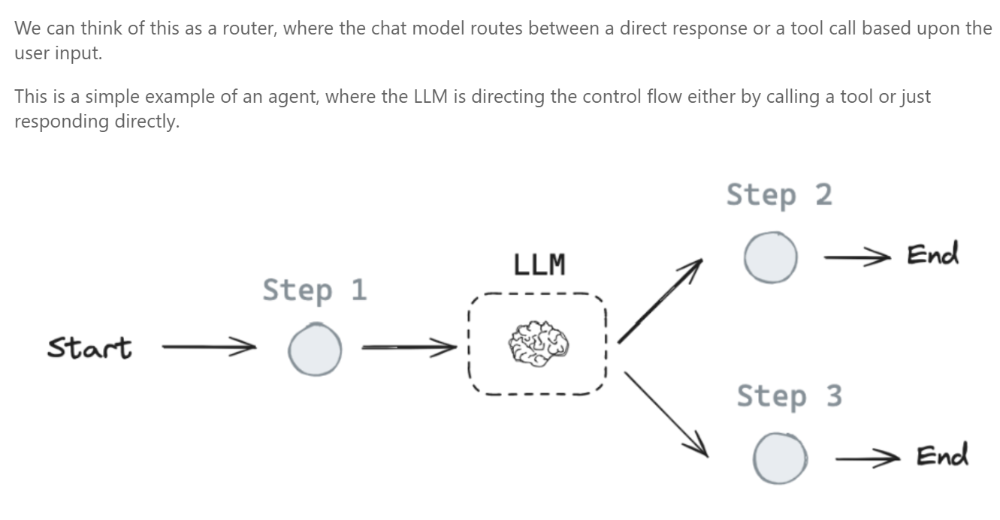
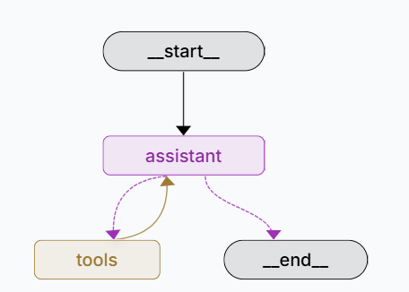

# Workshop overview

## **Prompt Engineering**: Practice talking with LLMs. [Notebook](nb01_TalkingToLLMs_Prompting.ipynb)
  
## **Retrieval Augmented Generation (RAG)**
  - Intro [Notebook](nb02_RAG_talknigWithLLMs_and_ownTextData.ipynb)
  - RAG as data extractor from webpages. [Notebook](nb02b1_RAG_exercise_webpage_emailId_extracter.ipynb)
  - RAG Summarize webpage. [Notebook](nb02b_RAG_exercise_HTMLpage.ipynb)
  - RAG with pdf article. [Notebook](nb02c_RAG_exercise_researchArticle.ipynb)

## **[Langgraphs basics](nb04_Langraph_basics.ipynb)** 
  
  
### [Router](studio\router.py)

### [Simple Agent](studio\agent.py)

### [Agent with WebSearch capacity](studio\webSearchAgent.py)

## **[TODO Next Time]A multiagent Assistant**

### [TODO] Multi agent swarm
https://www.youtube.com/watch?v=WTr6mHTw5cM
https://www.youtube.com/watch?v=4oC1ZKa9-Hs

https://mirror-feeling-d80.notion.site/Fully-Local-Multi-Agent-1b5808527b178066bde0ed981b27998c

### [TODO] Research Assistant https://github.com/krajit/open_deep_research_langgraph
https://www.youtube.com/watch?v=2mSNIX-l_Zc

